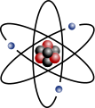

<h3 id="siteSub" class="noprint"><em>The Physics Portal</em></h3>

&nbsp;

<strong><a title="Physics" href="https://en.wikipedia.org/wiki/Physics">Physics</a></strong>&nbsp;(from&nbsp;<a class="mw-redirect" title="Ancient Greek language" href="https://en.wikipedia.org/wiki/Ancient_Greek_language">Ancient Greek</a>:&nbsp;&phi;&upsilon;&sigma;&iota;&kappa;ή (ἐ&pi;&iota;&sigma;&tau;ή&mu;&eta;),&nbsp;<small><a class="mw-redirect" title="Romanization of Ancient Greek" href="https://en.wikipedia.org/wiki/Romanization_of_Ancient_Greek">romanized</a>:&nbsp;</small><em lang="grc-Latn" title="Ancient Greek-language romanization">physikḗ (epistḗmē)</em>,&nbsp;<small><a title="Literal translation" href="https://en.wikipedia.org/wiki/Literal_translation">lit.</a>&nbsp;</small>'knowledge of nature', from&nbsp;&phi;ύ&sigma;&iota;&sigmaf;&nbsp;<em>ph&yacute;sis</em>&nbsp;'nature') is the&nbsp;<a title="Natural science" href="https://en.wikipedia.org/wiki/Natural_science">natural science</a>&nbsp;that studies&nbsp;<a title="Matter" href="https://en.wikipedia.org/wiki/Matter">matter</a>, its&nbsp;<a class="mw-redirect" title="Motion (physics)" href="https://en.wikipedia.org/wiki/Motion_(physics)">motion</a>&nbsp;and behavior through&nbsp;<a title="Spacetime" href="https://en.wikipedia.org/wiki/Spacetime">space and time</a>, and the related entities of&nbsp;<a title="Energy" href="https://en.wikipedia.org/wiki/Energy">energy</a>&nbsp;and&nbsp;<a title="Force" href="https://en.wikipedia.org/wiki/Force">force</a>. Physics is one of the most fundamental scientific disciplines, and its main goal is to understand how the&nbsp;<a title="Universe" href="https://en.wikipedia.org/wiki/Universe">universe</a>&nbsp;behaves.

Physics is one of the oldest&nbsp;<a title="Academic discipline" href="https://en.wikipedia.org/wiki/Academic_discipline">academic disciplines</a>&nbsp;and, through its inclusion of&nbsp;<a title="Astronomy" href="https://en.wikipedia.org/wiki/Astronomy">astronomy</a>, perhaps&nbsp;<em>the</em>&nbsp;oldest. Over much of the past two millennia, physics,&nbsp;<a title="Chemistry" href="https://en.wikipedia.org/wiki/Chemistry">chemistry</a>,&nbsp;<a title="Biology" href="https://en.wikipedia.org/wiki/Biology">biology</a>, and certain branches of&nbsp;<a title="Mathematics" href="https://en.wikipedia.org/wiki/Mathematics">mathematics</a>&nbsp;were a part of&nbsp;<a title="Natural philosophy" href="https://en.wikipedia.org/wiki/Natural_philosophy">natural philosophy</a>, but during the&nbsp;<a title="Scientific Revolution" href="https://en.wikipedia.org/wiki/Scientific_Revolution">Scientific Revolution</a>&nbsp;in the 17th century these natural sciences emerged as unique research endeavors in their own right. Physics intersects with many&nbsp;<a title="Interdisciplinarity" href="https://en.wikipedia.org/wiki/Interdisciplinarity">interdisciplinary</a>&nbsp;areas of research, such as&nbsp;<a title="Biophysics" href="https://en.wikipedia.org/wiki/Biophysics">biophysics</a>&nbsp;and&nbsp;<a title="Quantum chemistry" href="https://en.wikipedia.org/wiki/Quantum_chemistry">quantum chemistry</a>, and the boundaries of physics are not&nbsp;<a title="Demarcation problem" href="https://en.wikipedia.org/wiki/Demarcation_problem">rigidly defined</a>. New ideas in physics often explain the fundamental mechanisms studied by other sciences and suggest new avenues of research in academic disciplines such as mathematics and&nbsp;<a title="Philosophy" href="https://en.wikipedia.org/wiki/Philosophy">philosophy</a>.

Advances in physics often enable advances in new&nbsp;<a title="Technology" href="https://en.wikipedia.org/wiki/Technology">technologies</a>. For example, advances in the understanding of&nbsp;<a title="Electromagnetism" href="https://en.wikipedia.org/wiki/Electromagnetism">electromagnetism</a>,&nbsp;<a title="Solid-state physics" href="https://en.wikipedia.org/wiki/Solid-state_physics">solid-state physics</a>, and&nbsp;<a title="Nuclear physics" href="https://en.wikipedia.org/wiki/Nuclear_physics">nuclear physics</a>&nbsp;led directly to the development of new products that have dramatically transformed modern-day society, such as&nbsp;<a title="Television" href="https://en.wikipedia.org/wiki/Television">television</a>,&nbsp;<a title="Computer" href="https://en.wikipedia.org/wiki/Computer">computers</a>,&nbsp;<a class="mw-redirect" title="Domestic appliance" href="https://en.wikipedia.org/wiki/Domestic_appliance">domestic appliances</a>, and&nbsp;<a title="Nuclear weapon" href="https://en.wikipedia.org/wiki/Nuclear_weapon">nuclear weapons</a>; advances in&nbsp;<a title="Thermodynamics" href="https://en.wikipedia.org/wiki/Thermodynamics">thermodynamics</a>&nbsp;led to the development of&nbsp;<a class="mw-redirect" title="Industrialization" href="https://en.wikipedia.org/wiki/Industrialization">industrialization</a>; and advances in&nbsp;<a title="Mechanics" href="https://en.wikipedia.org/wiki/Mechanics">mechanics</a>&nbsp;inspired the development of&nbsp;<a title="Calculus" href="https://en.wikipedia.org/wiki/Calculus">calculus</a>.

<strong><a title="Physics" href="https://en.wikipedia.org/wiki/Physics">Read more...</a></strong>

&nbsp;

&nbsp;

&nbsp;

Rabi, photographed in 1944

<strong><a title="Isidor Isaac Rabi" href="https://en.wikipedia.org/wiki/Isidor_Isaac_Rabi">Isidor Isaac Rabi</a></strong>&nbsp;(<a title="Help:IPA/English" href="https://en.wikipedia.org/wiki/Help:IPA/English">/ˈrɑːbi/</a>; born&nbsp;<strong>Israel Isaac Rabi</strong>, July 29, 1898&nbsp;&ndash; January 11, 1988) was an American&nbsp;<a title="Physicist" href="https://en.wikipedia.org/wiki/Physicist">physicist</a>&nbsp;who won the Nobel Prize in Physics in 1944 for his discovery of&nbsp;<a title="Nuclear magnetic resonance" href="https://en.wikipedia.org/wiki/Nuclear_magnetic_resonance">nuclear magnetic resonance</a>, which is used in&nbsp;<a title="Magnetic resonance imaging" href="https://en.wikipedia.org/wiki/Magnetic_resonance_imaging">magnetic resonance imaging</a>. He was also one of the first scientists in the United States to work on the&nbsp;<a title="Cavity magnetron" href="https://en.wikipedia.org/wiki/Cavity_magnetron">cavity magnetron</a>, which is used in&nbsp;<a class="mw-redirect" title="Microwave radar" href="https://en.wikipedia.org/wiki/Microwave_radar">microwave radar</a>&nbsp;and&nbsp;<a title="Microwave oven" href="https://en.wikipedia.org/wiki/Microwave_oven">microwave ovens</a>.

Born into a traditional&nbsp;<a title="History of the Jews in Poland" href="https://en.wikipedia.org/wiki/History_of_the_Jews_in_Poland">Polish-Jewish</a>&nbsp;family in&nbsp;<a title="Ryman&oacute;w" href="https://en.wikipedia.org/wiki/Ryman%C3%B3w">Ryman&oacute;w</a>,&nbsp;<a class="mw-redirect" title="Galicia (Central Europe)" href="https://en.wikipedia.org/wiki/Galicia_(Central_Europe)">Galicia</a>, Rabi came to the United States as a baby and was raised in New York's&nbsp;<a title="Lower East Side" href="https://en.wikipedia.org/wiki/Lower_East_Side">Lower East Side</a>. He entered&nbsp;<a title="Cornell University" href="https://en.wikipedia.org/wiki/Cornell_University">Cornell University</a>&nbsp;as an&nbsp;<a title="Electrical engineering" href="https://en.wikipedia.org/wiki/Electrical_engineering">electrical engineering</a>&nbsp;student in 1916, but soon switched to&nbsp;<a title="Chemistry" href="https://en.wikipedia.org/wiki/Chemistry">chemistry</a>. Later, he became interested in&nbsp;<a title="Physics" href="https://en.wikipedia.org/wiki/Physics">physics</a>. He continued his studies at&nbsp;<a title="Columbia University" href="https://en.wikipedia.org/wiki/Columbia_University">Columbia University</a>, where he was awarded his doctorate for a thesis on the&nbsp;<a title="Magnetic susceptibility" href="https://en.wikipedia.org/wiki/Magnetic_susceptibility">magnetic susceptibility</a>&nbsp;of certain crystals. In 1927, he headed for Europe, where he met and worked with many of the finest physicists of the time.&nbsp;<strong><a title="Isidor Isaac Rabi" href="https://en.wikipedia.org/wiki/Isidor_Isaac_Rabi">Read more...</a></strong>

&nbsp;

<h3 class="noprint">&nbsp;Did you know&nbsp;</h3>

&nbsp;

<ul>
<li>... that it is estimated that&nbsp;<strong><a title="Sun" href="https://en.wikipedia.org/wiki/Sun">The Sun</a></strong>&nbsp;burns around 620 million&nbsp;<strong><a class="mw-redirect" title="Metric tons" href="https://en.wikipedia.org/wiki/Metric_tons">metric tons</a></strong>&nbsp;of&nbsp;<strong><a title="Hydrogen" href="https://en.wikipedia.org/wiki/Hydrogen">Hydrogen</a></strong>&nbsp;per second into 616 million&nbsp;<strong><a class="mw-redirect" title="Metric tons" href="https://en.wikipedia.org/wiki/Metric_tons">metric tons</a></strong>&nbsp;of&nbsp;<strong><a title="Helium" href="https://en.wikipedia.org/wiki/Helium">Helium</a></strong>?</li>
</ul>
<ul>
<li>... that the&nbsp;<strong><a title="Big Bang" href="https://en.wikipedia.org/wiki/Big_Bang">Big Bang</a></strong>&nbsp;was secured as the best theory for the origin of the universe by the discovery of the&nbsp;<a class="mw-redirect" title="Cosmic microwave background radiation" href="https://en.wikipedia.org/wiki/Cosmic_microwave_background_radiation">cosmic microwave background radiation</a>&nbsp;in 1964?</li>
</ul>
<ul>
<li>... that&nbsp;<strong><a title="Neutron star" href="https://en.wikipedia.org/wiki/Neutron_star">neutron stars</a></strong>&nbsp;are so dense (10&sup1;⁷ kg/m&sup3;) that a teaspoonful (5&nbsp;<a title="Litre" href="https://en.wikipedia.org/wiki/Litre">mL</a>) would have ten times the mass of the total human population?</li>
</ul>

<strong><a title="Portal:Physics/Did you know" href="https://en.wikipedia.org/wiki/Portal:Physics/Did_you_know">More did you know...</a></strong>

&nbsp;

&nbsp;

&nbsp;

Hilde Levi

<strong><a title="Hilde Levi" href="https://en.wikipedia.org/wiki/Hilde_Levi">Hilde Levi</a></strong>&nbsp;(9 May 1909&nbsp;&ndash; 26 July 2003) was a German-Danish&nbsp;<a title="Physicist" href="https://en.wikipedia.org/wiki/Physicist">physicist</a>. She was a pioneer of the use of&nbsp;<a class="mw-redirect" title="Radioactive isotopes" href="https://en.wikipedia.org/wiki/Radioactive_isotopes">radioactive isotopes</a>&nbsp;in&nbsp;<a title="Biology" href="https://en.wikipedia.org/wiki/Biology">biology</a>&nbsp;and&nbsp;<a title="Medicine" href="https://en.wikipedia.org/wiki/Medicine">medicine</a>, notably the techniques of&nbsp;<a title="Radiocarbon dating" href="https://en.wikipedia.org/wiki/Radiocarbon_dating">radiocarbon dating</a>&nbsp;and&nbsp;<a class="mw-redirect" title="Autoradiography" href="https://en.wikipedia.org/wiki/Autoradiography">autoradiography</a>. In later life she became a scientific historian, and published a biography of&nbsp;<a title="George de Hevesy" href="https://en.wikipedia.org/wiki/George_de_Hevesy">George de Hevesy</a>.

Born into a non-religious Jewish family in&nbsp;<a title="Frankfurt" href="https://en.wikipedia.org/wiki/Frankfurt">Frankfurt</a>, Germany, Levi entered the&nbsp;<a class="mw-redirect" title="University of Munich" href="https://en.wikipedia.org/wiki/University_of_Munich">University of Munich</a>&nbsp;in 1929. She carried out her doctoral studies at the&nbsp;<a class="mw-redirect" title="Kaiser Wilhelm Institute for Physical Chemistry and Electrochemistry" href="https://en.wikipedia.org/wiki/Kaiser_Wilhelm_Institute_for_Physical_Chemistry_and_Electrochemistry">Kaiser Wilhelm Institute for Physical Chemistry and Electrochemistry</a>&nbsp;at&nbsp;<a title="Dahlem (Berlin)" href="https://en.wikipedia.org/wiki/Dahlem_(Berlin)">Berlin-Dahlem</a>, writing her thesis on the spectra of&nbsp;<a title="Alkali metal halide" href="https://en.wikipedia.org/wiki/Alkali_metal_halide">alkali metal halides</a>&nbsp;under the supervision of&nbsp;<a class="new" title="Peter Pringsheim (page does not exist)" href="https://en.wikipedia.org/w/index.php?title=Peter_Pringsheim&amp;action=edit&amp;redlink=1">Peter Pringsheim</a>&nbsp;[<a class="extiw" title="de:Peter Pringsheim" href="https://de.wikipedia.org/wiki/Peter_Pringsheim">de</a>]&nbsp;and&nbsp;<a title="Fritz Haber" href="https://en.wikipedia.org/wiki/Fritz_Haber">Fritz Haber</a>. By the time she completed it in 1934, the&nbsp;<a title="Nazi Party" href="https://en.wikipedia.org/wiki/Nazi_Party">Nazi Party</a>&nbsp;had been elected to office in Germany, and Jews were no longer allowed to be hired for academic positions. She went to Denmark where she found a position at the&nbsp;<a title="Niels Bohr Institute" href="https://en.wikipedia.org/wiki/Niels_Bohr_Institute">Niels Bohr Institute</a>&nbsp;of Theoretical Physics at the&nbsp;<a title="University of Copenhagen" href="https://en.wikipedia.org/wiki/University_of_Copenhagen">University of Copenhagen</a>. Working with&nbsp;<a title="James Franck" href="https://en.wikipedia.org/wiki/James_Franck">James Franck</a>&nbsp;and George de Hevesy, she published a number of papers on the use of radioactive substances in biology.&nbsp;<strong><a title="Hilde Levi" href="https://en.wikipedia.org/wiki/Hilde_Levi">Read more...</a></strong>

&nbsp;

&nbsp;

&nbsp;

<h3 class="plainlinks noprint">May anniversaries</h3>

<ul>
<li>May 1, 1960 -&nbsp;<a title="Lockheed U-2" href="https://en.wikipedia.org/wiki/Lockheed_U-2">U-2 spy plane</a>&nbsp;shot down</li>
<li>May 6, 1937 -&nbsp;<a title="Hindenburg disaster" href="https://en.wikipedia.org/wiki/Hindenburg_disaster">Hindenburg</a>&nbsp;fire</li>
<li>May 9, 1012 BC &ndash;&nbsp;<a class="mw-redirect" title="Solar Eclipse" href="https://en.wikipedia.org/wiki/Solar_Eclipse">Solar Eclipse</a>&nbsp;seen at&nbsp;<a title="Ugarit" href="https://en.wikipedia.org/wiki/Ugarit">Ugarit</a>, 6:09&ndash;6:39 PM.</li>
<li>May 9, 1904 &ndash;&nbsp;<a class="mw-redirect" title="City of Truro" href="https://en.wikipedia.org/wiki/City_of_Truro">City of Truro</a>, a steam locomotive exceeds 100 mph (160 km/h).</li>
<li>May 10, 1946 &ndash;&nbsp;<a title="V-2 rocket" href="https://en.wikipedia.org/wiki/V-2_rocket">V-2 rocket</a>'s first successful launch at&nbsp;<a class="mw-redirect" title="White Sands Proving Ground" href="https://en.wikipedia.org/wiki/White_Sands_Proving_Ground">White Sands Proving Ground</a></li>
<li>May 10, 1960 &ndash; The nuclear submarine&nbsp;<a title="USS Triton (SSRN-586)" href="https://en.wikipedia.org/wiki/USS_Triton_(SSRN-586)">USS&nbsp;<em>Triton</em></a>&nbsp;completes&nbsp;<a title="Operation Sandblast" href="https://en.wikipedia.org/wiki/Operation_Sandblast">Operation Sandblast</a>, the first underwater&nbsp;<a title="Circumnavigation" href="https://en.wikipedia.org/wiki/Circumnavigation">circumnavigation</a>&nbsp;of the&nbsp;<a title="Earth" href="https://en.wikipedia.org/wiki/Earth">earth</a>.</li>
<li>May 11, 1862 &ndash;&nbsp;<a title="American Civil War" href="https://en.wikipedia.org/wiki/American_Civil_War">American Civil War</a>: The ironclad&nbsp;<a title="CSS Virginia" href="https://en.wikipedia.org/wiki/CSS_Virginia">CSS&nbsp;<em>Virginia</em></a>&nbsp;is scuttled in&nbsp;<a title="Virginia" href="https://en.wikipedia.org/wiki/Virginia">Virginia</a>.</li>
<li>May 11, 1995 &ndash; In&nbsp;<a title="New York City" href="https://en.wikipedia.org/wiki/New_York_City">New York City</a>, over 170 countries extend&nbsp;<a class="mw-redirect" title="Nuclear Nonproliferation Treaty" href="https://en.wikipedia.org/wiki/Nuclear_Nonproliferation_Treaty">Nuclear Nonproliferation Treaty</a>&nbsp;indefinitely, without conditions.</li>
<li>May 11, 1998 &ndash;&nbsp;<a title="India" href="https://en.wikipedia.org/wiki/India">India</a>&nbsp;conducts three underground&nbsp;<a class="mw-redirect" title="Nuclear test" href="https://en.wikipedia.org/wiki/Nuclear_test">nuclear tests</a>, including a&nbsp;<a class="mw-redirect" title="Thermonuclear device" href="https://en.wikipedia.org/wiki/Thermonuclear_device">thermonuclear device</a>.</li>
<li>May 14, 2018 - Ennackal Chandy George Sudarshan died.</li>
<li>May 16, 1960 -&nbsp;<a title="Theodore Maiman" href="https://en.wikipedia.org/wiki/Theodore_Maiman">Theodore Maiman</a>&nbsp;operates the first optical&nbsp;<a title="Laser" href="https://en.wikipedia.org/wiki/Laser">laser</a>, at&nbsp;<a class="mw-redirect" title="Hughes Research Laboratories" href="https://en.wikipedia.org/wiki/Hughes_Research_Laboratories">Hughes Research Laboratories</a>&nbsp;in&nbsp;<a title="Malibu, California" href="https://en.wikipedia.org/wiki/Malibu,_California">Malibu</a>,&nbsp;<a title="California" href="https://en.wikipedia.org/wiki/California">California</a>.</li>
<li>May 16, 1969 &ndash;&nbsp;<a title="Venera 5" href="https://en.wikipedia.org/wiki/Venera_5">Venera 5</a>, a Soviet&nbsp;<a class="mw-redirect" title="Spaceprobe" href="https://en.wikipedia.org/wiki/Spaceprobe">spaceprobe</a>, lands on&nbsp;<a title="Venus" href="https://en.wikipedia.org/wiki/Venus">Venus</a>.</li>
<li>May 17, 1865 &ndash; The&nbsp;<a class="mw-redirect" title="International Telegraph Union" href="https://en.wikipedia.org/wiki/International_Telegraph_Union">International Telegraph Union</a>&nbsp;is established.</li>
<li>May 18, 1998 -&nbsp;<a title="Microsoft" href="https://en.wikipedia.org/wiki/Microsoft">Microsoft</a>&nbsp;sued by US Government</li>
<li>May 19, 1943 -&nbsp;<a class="mw-redirect" title="RAF" href="https://en.wikipedia.org/wiki/RAF">RAF</a>&nbsp;uses bouncing bombs in combat</li>
<li>May 20, 1932 -&nbsp;<a title="Amelia Earhart" href="https://en.wikipedia.org/wiki/Amelia_Earhart">Amelia Earhart</a>&nbsp;crosses&nbsp;<a title="Atlantic Ocean" href="https://en.wikipedia.org/wiki/Atlantic_Ocean">Atlantic Ocean</a></li>
<li>May 26, 1972 -&nbsp;<a class="mw-redirect" title="President Nixon" href="https://en.wikipedia.org/wiki/President_Nixon">President Nixon</a>&nbsp;and&nbsp;<a title="Leonid Brezhnev" href="https://en.wikipedia.org/wiki/Leonid_Brezhnev">Leonid Brezhnev</a>&nbsp;sign&nbsp;<a title="Nuclear weapon" href="https://en.wikipedia.org/wiki/Nuclear_weapon">nuclear weapon</a>&nbsp;non-proliferation pact.</li>
<li>May 24, 1844 - First official&nbsp;<a class="mw-redirect" title="Telegraph" href="https://en.wikipedia.org/wiki/Telegraph">telegraph</a>&nbsp;message is sent by&nbsp;<a title="Samuel Morse" href="https://en.wikipedia.org/wiki/Samuel_Morse">Samuel Morse</a>.</li>
<li>May 27, 1937 - Grand opening,&nbsp;<a title="Golden Gate Bridge" href="https://en.wikipedia.org/wiki/Golden_Gate_Bridge">Golden Gate Bridge</a></li>
<li>May 28, 1998 &ndash;&nbsp;<a title="Pakistan" href="https://en.wikipedia.org/wiki/Pakistan">Pakistan</a>&nbsp;conducts five underground&nbsp;<a class="mw-redirect" title="Nuclear test" href="https://en.wikipedia.org/wiki/Nuclear_test">nuclear tests</a>, named&nbsp;<a title="Chagai-I" href="https://en.wikipedia.org/wiki/Chagai-I">Chagai-I</a>.</li>
</ul>
<h3>Births</h3>
<ul>
<li>May 6, 1872 -&nbsp;<a title="Willem de Sitter" href="https://en.wikipedia.org/wiki/Willem_de_Sitter">Willem de Sitter</a>, physicist, mathematician, and astronomer</li>
<li>May 9, 1931 &ndash;&nbsp;<a class="mw-redirect" title="Vance Brand" href="https://en.wikipedia.org/wiki/Vance_Brand">Vance Brand</a>, astronaut</li>
<li>May 10, 1746 &ndash;&nbsp;<a title="Gaspard Monge" href="https://en.wikipedia.org/wiki/Gaspard_Monge">Gaspard Monge</a>, mathematician</li>
<li>May 10, 1788 &ndash;&nbsp;<a title="Augustin-Jean Fresnel" href="https://en.wikipedia.org/wiki/Augustin-Jean_Fresnel">Augustin-Jean Fresnel</a>&nbsp;physicist</li>
<li>May 10, 1963 &ndash;&nbsp;<a title="Lisa Nowak" href="https://en.wikipedia.org/wiki/Lisa_Nowak">Lisa Nowak</a>, astronaut</li>
<li>May 11, 1918 &ndash;&nbsp;<a title="Richard Feynman" href="https://en.wikipedia.org/wiki/Richard_Feynman">Richard Feynman</a>, physicist</li>
<li>May 14, 1686 -&nbsp;<a class="mw-redirect" title="Gabriel Fahrenheit" href="https://en.wikipedia.org/wiki/Gabriel_Fahrenheit">Gabriel Fahrenheit</a>, physicist and engineer</li>
<li>May 21, 1921 -&nbsp;<a title="Andrei Sakharov" href="https://en.wikipedia.org/wiki/Andrei_Sakharov">Andrei Sakharov</a>, nuclear physicist</li>
<li>May 7,1861 -&nbsp;<a title="Rabindranath Tagore" href="https://en.wikipedia.org/wiki/Rabindranath_Tagore">Rabindranath Tagore</a>, poet, patriotist, and philosopher</li>
</ul>
<h3>Deaths</h3>
<ul>
<li>May 10, 1482 &ndash;&nbsp;<a title="Paolo dal Pozzo Toscanelli" href="https://en.wikipedia.org/wiki/Paolo_dal_Pozzo_Toscanelli">Paolo dal Pozzo Toscanelli</a>, mathematician and astronomer</li>
<li>May 16, 1830 &ndash;&nbsp;<a title="Joseph Fourier" href="https://en.wikipedia.org/wiki/Joseph_Fourier">Joseph Fourier</a>, French scientist</li>
<li>May 17, 1916 &ndash;&nbsp;<a class="mw-redirect" title="Boris Borisovich Galitzine" href="https://en.wikipedia.org/wiki/Boris_Borisovich_Galitzine">Boris Borisovich Galitzine</a>, Russian physicist</li>
</ul>

<strong><a title="Portal:Physics/Anniversaries" href="https://en.wikipedia.org/wiki/Portal:Physics/Anniversaries">More anniversaries</a></strong>

&nbsp;

&nbsp;

<h2>Categories</h2>

<strong>Fundamentals</strong>:&nbsp;<a title="Category:Concepts in physics" href="https://en.wikipedia.org/wiki/Category:Concepts_in_physics">Concepts in physics</a>&nbsp;|&nbsp;<a title="Category:Constants" href="https://en.wikipedia.org/wiki/Category:Constants">Constants</a>&nbsp;|&nbsp;<a title="Category:Physical quantities" href="https://en.wikipedia.org/wiki/Category:Physical_quantities">Physical quantities</a>&nbsp;|&nbsp;<a title="Category:Units of measurement" href="https://en.wikipedia.org/wiki/Category:Units_of_measurement">Units of measure</a>&nbsp;|&nbsp;<a title="Category:Mass" href="https://en.wikipedia.org/wiki/Category:Mass">Mass</a>&nbsp;|&nbsp;<a title="Category:Length" href="https://en.wikipedia.org/wiki/Category:Length">Length</a>&nbsp;|&nbsp;<a title="Category:Time" href="https://en.wikipedia.org/wiki/Category:Time">Time</a>&nbsp;|&nbsp;<a title="Category:Space" href="https://en.wikipedia.org/wiki/Category:Space">Space</a>&nbsp;|&nbsp;<a title="Category:Energy" href="https://en.wikipedia.org/wiki/Category:Energy">Energy</a>&nbsp;|&nbsp;<a title="Category:Matter" href="https://en.wikipedia.org/wiki/Category:Matter">Matter</a>&nbsp;|&nbsp;<a title="Category:Force" href="https://en.wikipedia.org/wiki/Category:Force">Force</a>&nbsp;|&nbsp;<a title="Category:Gravity" href="https://en.wikipedia.org/wiki/Category:Gravity">Gravity</a>&nbsp;|&nbsp;<a title="Category:Electricity" href="https://en.wikipedia.org/wiki/Category:Electricity">Electricity</a>&nbsp;|&nbsp;<a title="Category:Magnetism" href="https://en.wikipedia.org/wiki/Category:Magnetism">Magnetism</a>&nbsp;|&nbsp;<a title="Category:Waves" href="https://en.wikipedia.org/wiki/Category:Waves">Waves</a>

<strong>Basic physics</strong>:&nbsp;<a title="Category:Mechanics" href="https://en.wikipedia.org/wiki/Category:Mechanics">Mechanics</a>&nbsp;|&nbsp;<a title="Category:Electromagnetism" href="https://en.wikipedia.org/wiki/Category:Electromagnetism">Electromagnetism</a>&nbsp;|&nbsp;<a title="Category:Statistical mechanics" href="https://en.wikipedia.org/wiki/Category:Statistical_mechanics">Statistical mechanics</a>&nbsp;|&nbsp;<a title="Category:Thermodynamics" href="https://en.wikipedia.org/wiki/Category:Thermodynamics">Thermodynamics</a>&nbsp;|&nbsp;<a title="Category:Quantum mechanics" href="https://en.wikipedia.org/wiki/Category:Quantum_mechanics">Quantum mechanics</a>&nbsp;|&nbsp;<a title="Category:Theory of relativity" href="https://en.wikipedia.org/wiki/Category:Theory_of_relativity">Theory of relativity</a>&nbsp;|&nbsp;<a title="Category:Optics" href="https://en.wikipedia.org/wiki/Category:Optics">Optics</a>&nbsp;|&nbsp;<a title="Category:Acoustics" href="https://en.wikipedia.org/wiki/Category:Acoustics">Acoustics</a>

<strong>Specific fields</strong>:&nbsp;<a title="Category:Acoustics" href="https://en.wikipedia.org/wiki/Category:Acoustics">Acoustics</a>&nbsp;|&nbsp;<a title="Category:Astrophysics" href="https://en.wikipedia.org/wiki/Category:Astrophysics">Astrophysics</a>&nbsp;|&nbsp;<a title="Category:Atomic physics" href="https://en.wikipedia.org/wiki/Category:Atomic_physics">Atomic physics</a>&nbsp;|&nbsp;<a title="Category:Molecular physics" href="https://en.wikipedia.org/wiki/Category:Molecular_physics">Molecular physics</a>&nbsp;|&nbsp;<a title="Category:Optics" href="https://en.wikipedia.org/wiki/Category:Optics">Optical physics</a>&nbsp;|&nbsp;<a title="Category:Computational physics" href="https://en.wikipedia.org/wiki/Category:Computational_physics">Computational physics</a>&nbsp;|&nbsp;<a title="Category:Condensed matter physics" href="https://en.wikipedia.org/wiki/Category:Condensed_matter_physics">Condensed matter physics</a>&nbsp;|&nbsp;<a title="Category:Nuclear physics" href="https://en.wikipedia.org/wiki/Category:Nuclear_physics">Nuclear physics</a>&nbsp;|&nbsp;<a title="Category:Particle physics" href="https://en.wikipedia.org/wiki/Category:Particle_physics">Particle physics</a>&nbsp;|&nbsp;<a title="Category:Plasma physics" href="https://en.wikipedia.org/wiki/Category:Plasma_physics">Plasma physics</a>

<strong>Tools</strong>:&nbsp;<a title="Category:Detectors" href="https://en.wikipedia.org/wiki/Category:Detectors">Detectors</a>&nbsp;|&nbsp;<a title="Category:Interferometry" href="https://en.wikipedia.org/wiki/Category:Interferometry">Interferometry</a>&nbsp;|&nbsp;<a title="Category:Measurement" href="https://en.wikipedia.org/wiki/Category:Measurement">Measurement</a>&nbsp;|&nbsp;<a title="Category:Radiometry" href="https://en.wikipedia.org/wiki/Category:Radiometry">Radiometry</a>&nbsp;|&nbsp;<a title="Category:Spectroscopy" href="https://en.wikipedia.org/wiki/Category:Spectroscopy">Spectroscopy</a>&nbsp;|&nbsp;<a title="Category:Transducers" href="https://en.wikipedia.org/wiki/Category:Transducers">Transducers</a>

<strong>Background</strong>:&nbsp;<a title="Category:Physicists" href="https://en.wikipedia.org/wiki/Category:Physicists">Physicists</a>&nbsp;|&nbsp;<a title="Category:History of physics" href="https://en.wikipedia.org/wiki/Category:History_of_physics">History of physics</a>&nbsp;|&nbsp;<a title="Category:Philosophy of physics" href="https://en.wikipedia.org/wiki/Category:Philosophy_of_physics">Philosophy of physics</a>&nbsp;|&nbsp;<a title="Category:Physics education" href="https://en.wikipedia.org/wiki/Category:Physics_education">Physics education</a>&nbsp;|&nbsp;<a title="Category:Physics journals" href="https://en.wikipedia.org/wiki/Category:Physics_journals">Physics journals</a>&nbsp;|&nbsp;<a title="Category:Physics organizations" href="https://en.wikipedia.org/wiki/Category:Physics_organizations">Physics organizations</a>

<strong>Other</strong>:&nbsp;<a title="Category:Physics in fiction" href="https://en.wikipedia.org/wiki/Category:Physics_in_fiction">Physics in fiction</a>&nbsp;|&nbsp;<a title="Category:Pseudophysics" href="https://en.wikipedia.org/wiki/Category:Pseudophysics">Pseudophysics</a>&nbsp;|&nbsp;<a title="Category:Physics-related lists" href="https://en.wikipedia.org/wiki/Category:Physics-related_lists">Physics lists</a>&nbsp;|&nbsp;<a title="Category:Physics software" href="https://en.wikipedia.org/wiki/Category:Physics_software">Physics software</a>&nbsp;|&nbsp;<a title="Category:Physics stubs" href="https://en.wikipedia.org/wiki/Category:Physics_stubs">Physics stubs</a>

&nbsp;

&nbsp;

&nbsp;

&nbsp;

&nbsp;

&nbsp;

&nbsp;

Noted physicist&nbsp;<strong><a title="Stephen Hawking" href="https://en.wikipedia.org/wiki/Stephen_Hawking">Stephen Hawking</a></strong>&nbsp;(center) enjoys zero gravity during a flight aboard a modified Boeing 727 aircraft owned by&nbsp;<a title="Zero Gravity Corporation" href="https://en.wikipedia.org/wiki/Zero_Gravity_Corporation">Zero Gravity Corporation</a>&nbsp;(Zero G)

&nbsp;

&nbsp;

<h3>Good articles</h3>

<ul>
<li><a title="2019 redefinition of the SI base units" href="https://en.wikipedia.org/wiki/2019_redefinition_of_the_SI_base_units">2019 redefinition of the SI base units</a></li>
<li><a title="Harold Agnew" href="https://en.wikipedia.org/wiki/Harold_Agnew">Harold Agnew</a></li>
<li><a title="Samuel King Allison" href="https://en.wikipedia.org/wiki/Samuel_King_Allison">Samuel King Allison</a></li>
<li><a title="Luis Walter Alvarez" href="https://en.wikipedia.org/wiki/Luis_Walter_Alvarez">Luis Walter Alvarez</a></li>
<li><a title="Ames Project" href="https://en.wikipedia.org/wiki/Ames_Project">Ames Project</a></li>
<li><a title="Elda Emma Anderson" href="https://en.wikipedia.org/wiki/Elda_Emma_Anderson">Elda Emma Anderson</a></li>
<li><a title="Antimetric electrical network" href="https://en.wikipedia.org/wiki/Antimetric_electrical_network">Antimetric electrical network</a></li>
<li><a title="Aristotle" href="https://en.wikipedia.org/wiki/Aristotle">Aristotle</a></li>
<li><a title="Astronomy" href="https://en.wikipedia.org/wiki/Astronomy">Astronomy</a></li>
<li><a title="Atmosphere of Uranus" href="https://en.wikipedia.org/wiki/Atmosphere_of_Uranus">Atmosphere of Uranus</a></li>
<li><a title="Atomic theory" href="https://en.wikipedia.org/wiki/Atomic_theory">Atomic theory</a></li>
<li><a title="Avogadro constant" href="https://en.wikipedia.org/wiki/Avogadro_constant">Avogadro constant</a></li>
<li><a title="Robert Bacher" href="https://en.wikipedia.org/wiki/Robert_Bacher">Robert Bacher</a></li>
<li><a title="Kenneth Bainbridge" href="https://en.wikipedia.org/wiki/Kenneth_Bainbridge">Kenneth Bainbridge</a></li>
<li><a title="Hans Bethe" href="https://en.wikipedia.org/wiki/Hans_Bethe">Hans Bethe</a></li>
<li><a title="Bicycle and motorcycle dynamics" href="https://en.wikipedia.org/wiki/Bicycle_and_motorcycle_dynamics">Bicycle and motorcycle dynamics</a></li>
<li><a title="Francis Birch (geophysicist)" href="https://en.wikipedia.org/wiki/Francis_Birch_(geophysicist)">Francis Birch (geophysicist)</a></li>
<li><a title="Black hole" href="https://en.wikipedia.org/wiki/Black_hole">Black hole</a></li>
<li><a title="Aage Bohr" href="https://en.wikipedia.org/wiki/Aage_Bohr">Aage Bohr</a></li>
<li><a title="Max Born" href="https://en.wikipedia.org/wiki/Max_Born">Max Born</a></li>
<li><a title="Bouncing ball" href="https://en.wikipedia.org/wiki/Bouncing_ball">Bouncing ball</a></li>
<li><a title="Norris Bradbury" href="https://en.wikipedia.org/wiki/Norris_Bradbury">Norris Bradbury</a></li>
<li><a title="Hugh Bradner" href="https://en.wikipedia.org/wiki/Hugh_Bradner">Hugh Bradner</a></li>
<li><a title="Celestial spheres" href="https://en.wikipedia.org/wiki/Celestial_spheres">Celestial spheres</a></li>
<li><a title="Robert F. Christy" href="https://en.wikipedia.org/wiki/Robert_F._Christy">Robert F. Christy</a></li>
<li><a title="Clapotis" href="https://en.wikipedia.org/wiki/Clapotis">Clapotis</a></li>
<li><a title="John Cockcroft" href="https://en.wikipedia.org/wiki/John_Cockcroft">John Cockcroft</a></li>
<li><a title="Arthur Compton" href="https://en.wikipedia.org/wiki/Arthur_Compton">Arthur Compton</a></li>
<li><a title="Condensed matter physics" href="https://en.wikipedia.org/wiki/Condensed_matter_physics">Condensed matter physics</a></li>
<li><a title="Edward Condon" href="https://en.wikipedia.org/wiki/Edward_Condon">Edward Condon</a></li>
<li><a title="Corbett's electrostatic machine" href="https://en.wikipedia.org/wiki/Corbett%27s_electrostatic_machine">Corbett's electrostatic machine</a></li>
<li><a title="Edward Creutz" href="https://en.wikipedia.org/wiki/Edward_Creutz">Edward Creutz</a></li>
<li><a title="Charles Critchfield" href="https://en.wikipedia.org/wiki/Charles_Critchfield">Charles Critchfield</a></li>
<li><a title="Marie Curie" href="https://en.wikipedia.org/wiki/Marie_Curie">Marie Curie</a></li>
<li><a title="Joan Curran" href="https://en.wikipedia.org/wiki/Joan_Curran">Joan Curran</a></li>
<li><a title="Cyclone" href="https://en.wikipedia.org/wiki/Cyclone">Cyclone</a></li>
<li><a title="DU spectrophotometer" href="https://en.wikipedia.org/wiki/DU_spectrophotometer">DU spectrophotometer</a></li>
<li><a title="Harry Daghlian" href="https://en.wikipedia.org/wiki/Harry_Daghlian">Harry Daghlian</a></li>
<li><a title="Deep Impact (spacecraft)" href="https://en.wikipedia.org/wiki/Deep_Impact_(spacecraft)">Deep Impact (spacecraft)</a></li>
<li><a title="Diffusion damping" href="https://en.wikipedia.org/wiki/Diffusion_damping">Diffusion damping</a></li>
<li><a title="Dirac delta function" href="https://en.wikipedia.org/wiki/Dirac_delta_function">Dirac delta function</a></li>
<li><a title="Discovery of the neutron" href="https://en.wikipedia.org/wiki/Discovery_of_the_neutron">Discovery of the neutron</a></li>
<li><a title="Dynamics of the celestial spheres" href="https://en.wikipedia.org/wiki/Dynamics_of_the_celestial_spheres">Dynamics of the celestial spheres</a></li>
<li><a title="Earth's magnetic field" href="https://en.wikipedia.org/wiki/Earth%27s_magnetic_field">Earth's magnetic field</a></li>
<li><a title="Ecliptic" href="https://en.wikipedia.org/wiki/Ecliptic">Ecliptic</a></li>
<li><a title="Albert Einstein" href="https://en.wikipedia.org/wiki/Albert_Einstein">Albert Einstein</a></li>
<li><a title="Einstein&ndash;Szil&aacute;rd letter" href="https://en.wikipedia.org/wiki/Einstein%E2%80%93Szil%C3%A1rd_letter">Einstein&ndash;Szil&aacute;rd letter</a></li>
<li><a title="Elastance" href="https://en.wikipedia.org/wiki/Elastance">Elastance</a></li>
<li><a title="Electricity" href="https://en.wikipedia.org/wiki/Electricity">Electricity</a></li>
<li><a title="Experiments and Observations on Electricity" href="https://en.wikipedia.org/wiki/Experiments_and_Observations_on_Electricity">Experiments and Observations on Electricity</a></li>
<li><a title="Ronald Fedkiw" href="https://en.wikipedia.org/wiki/Ronald_Fedkiw">Ronald Fedkiw</a></li>
<li><a title="Val Logsdon Fitch" href="https://en.wikipedia.org/wiki/Val_Logsdon_Fitch">Val Logsdon Fitch</a></li>
<li><a title="Fizeau&ndash;Foucault apparatus" href="https://en.wikipedia.org/wiki/Fizeau%E2%80%93Foucault_apparatus">Fizeau&ndash;Foucault apparatus</a></li>
<li><a title="Fizeau experiment" href="https://en.wikipedia.org/wiki/Fizeau_experiment">Fizeau experiment</a></li>
<li><a title="Flerovium" href="https://en.wikipedia.org/wiki/Flerovium">Flerovium</a></li>
<li><a title="Floating Clouds (artwork)" href="https://en.wikipedia.org/wiki/Floating_Clouds_(artwork)">Floating Clouds (artwork)</a></li>
<li><a title="Force" href="https://en.wikipedia.org/wiki/Force">Force</a></li>
<li><a title="Foster's reactance theorem" href="https://en.wikipedia.org/wiki/Foster%27s_reactance_theorem">Foster's reactance theorem</a></li>
<li><a title="James Franck" href="https://en.wikipedia.org/wiki/James_Franck">James Franck</a></li>
<li><a title="Franklin's electrostatic machine" href="https://en.wikipedia.org/wiki/Franklin%27s_electrostatic_machine">Franklin's electrostatic machine</a></li>
<li><a title="Frisch&ndash;Peierls memorandum" href="https://en.wikipedia.org/wiki/Frisch%E2%80%93Peierls_memorandum">Frisch&ndash;Peierls memorandum</a></li>
<li><a title="Frog battery" href="https://en.wikipedia.org/wiki/Frog_battery">Frog battery</a></li>
<li><a title="Klaus Fuchs" href="https://en.wikipedia.org/wiki/Klaus_Fuchs">Klaus Fuchs</a></li>
<li><a title="Galileo Galilei" href="https://en.wikipedia.org/wiki/Galileo_Galilei">Galileo Galilei</a></li>
<li><a title="Geostationary orbit" href="https://en.wikipedia.org/wiki/Geostationary_orbit">Geostationary orbit</a></li>
<li><a title="Geothermal energy" href="https://en.wikipedia.org/wiki/Geothermal_energy">Geothermal energy</a></li>
<li><a title="Gleason's theorem" href="https://en.wikipedia.org/wiki/Gleason%27s_theorem">Gleason's theorem</a></li>
<li><a title="Maria Goeppert Mayer" href="https://en.wikipedia.org/wiki/Maria_Goeppert_Mayer">Maria Goeppert Mayer</a></li>
<li><a title="Alvin C. Graves" href="https://en.wikipedia.org/wiki/Alvin_C._Graves">Alvin C. Graves</a></li>
<li><a title="Gravity bong" href="https://en.wikipedia.org/wiki/Gravity_bong">Gravity bong</a></li>
<li><a title="John T. Hayward" href="https://en.wikipedia.org/wiki/John_T._Hayward">John T. Hayward</a></li>
<li><a title="Hilbert space" href="https://en.wikipedia.org/wiki/Hilbert_space">Hilbert space</a></li>
<li><a title="History of the metric system" href="https://en.wikipedia.org/wiki/History_of_the_metric_system">History of the metric system</a></li>
<li><a title="Mujaddid Ahmed Ijaz" href="https://en.wikipedia.org/wiki/Mujaddid_Ahmed_Ijaz">Mujaddid Ahmed Ijaz</a></li>
<li><a title="Interferometry" href="https://en.wikipedia.org/wiki/Interferometry">Interferometry</a></li>
<li><a title="International System of Units" href="https://en.wikipedia.org/wiki/International_System_of_Units">International System of Units</a></li>
<li><a title="Mary Jackson (engineer)" href="https://en.wikipedia.org/wiki/Mary_Jackson_(engineer)">Mary Jackson (engineer)</a></li>
<li><a title="Brian Josephson" href="https://en.wikipedia.org/wiki/Brian_Josephson">Brian Josephson</a></li>
<li><a title="Donald William Kerst" href="https://en.wikipedia.org/wiki/Donald_William_Kerst">Donald William Kerst</a></li>
<li><a title="Kilogram" href="https://en.wikipedia.org/wiki/Kilogram">Kilogram</a></li>
<li><a title="Laser Inertial Fusion Energy" href="https://en.wikipedia.org/wiki/Laser_Inertial_Fusion_Energy">Laser Inertial Fusion Energy</a></li>
<li><a title="Ernest Lawrence" href="https://en.wikipedia.org/wiki/Ernest_Lawrence">Ernest Lawrence</a></li>
<li><a title="Hilde Levi" href="https://en.wikipedia.org/wiki/Hilde_Levi">Hilde Levi</a></li>
<li><a title="Liquid crystal" href="https://en.wikipedia.org/wiki/Liquid_crystal">Liquid crystal</a></li>
<li><a title="MAUD Committee" href="https://en.wikipedia.org/wiki/MAUD_Committee">MAUD Committee</a></li>
<li><a title="Magnetic resonance imaging" href="https://en.wikipedia.org/wiki/Magnetic_resonance_imaging">Magnetic resonance imaging</a></li>
<li><a title="Malaysia Airlines Flight 370 satellite communications" href="https://en.wikipedia.org/wiki/Malaysia_Airlines_Flight_370_satellite_communications">Malaysia Airlines Flight 370 satellite communications</a></li>
<li><a title="John Marburger" href="https://en.wikipedia.org/wiki/John_Marburger">John Marburger</a></li>
<li><a title="Leslie H. Martin" href="https://en.wikipedia.org/wiki/Leslie_H._Martin">Leslie H. Martin</a></li>
<li><a title="Harrie Massey" href="https://en.wikipedia.org/wiki/Harrie_Massey">Harrie Massey</a></li>
<li><a title="Maximum sustained wind" href="https://en.wikipedia.org/wiki/Maximum_sustained_wind">Maximum sustained wind</a></li>
<li><a title="James Clerk Maxwell" href="https://en.wikipedia.org/wiki/James_Clerk_Maxwell">James Clerk Maxwell</a></li>
<li><a title="Boyce McDaniel" href="https://en.wikipedia.org/wiki/Boyce_McDaniel">Boyce McDaniel</a></li>
<li><a title="Metric system" href="https://en.wikipedia.org/wiki/Metric_system">Metric system</a></li>
<li><a title="Mobility analogy" href="https://en.wikipedia.org/wiki/Mobility_analogy">Mobility analogy</a></li>
<li><a title="Molniya orbit" href="https://en.wikipedia.org/wiki/Molniya_orbit">Molniya orbit</a></li>
<li><a title="Philip Morrison" href="https://en.wikipedia.org/wiki/Philip_Morrison">Philip Morrison</a></li>
<li><a title="Nature" href="https://en.wikipedia.org/wiki/Nature">Nature</a></li>
<li><a title="Seth Neddermeyer" href="https://en.wikipedia.org/wiki/Seth_Neddermeyer">Seth Neddermeyer</a></li>
<li><a title="Negative resistance" href="https://en.wikipedia.org/wiki/Negative_resistance">Negative resistance</a></li>
<li><a title="John von Neumann" href="https://en.wikipedia.org/wiki/John_von_Neumann">John von Neumann</a></li>
<li><a title="Neutron magnetic moment" href="https://en.wikipedia.org/wiki/Neutron_magnetic_moment">Neutron magnetic moment</a></li>
<li><a title="Isaac Newton" href="https://en.wikipedia.org/wiki/Isaac_Newton">Isaac Newton</a></li>
<li><a title="Newton's theorem of revolving orbits" href="https://en.wikipedia.org/wiki/Newton%27s_theorem_of_revolving_orbits">Newton's theorem of revolving orbits</a></li>
<li><a title="Nobel Prize in Physics" href="https://en.wikipedia.org/wiki/Nobel_Prize_in_Physics">Nobel Prize in Physics</a></li>
<li><a title="Noctilucent cloud" href="https://en.wikipedia.org/wiki/Noctilucent_cloud">Noctilucent cloud</a></li>
<li><a title="Adriana Ocampo" href="https://en.wikipedia.org/wiki/Adriana_Ocampo">Adriana Ocampo</a></li>
<li><a title="Optical properties of carbon nanotubes" href="https://en.wikipedia.org/wiki/Optical_properties_of_carbon_nanotubes">Optical properties of carbon nanotubes</a></li>
<li><a title="Rudolf Peierls" href="https://en.wikipedia.org/wiki/Rudolf_Peierls">Rudolf Peierls</a></li>
<li><a title="Bruno Pontecorvo" href="https://en.wikipedia.org/wiki/Bruno_Pontecorvo">Bruno Pontecorvo</a></li>
<li><a title="Chanda Prescod-Weinstein" href="https://en.wikipedia.org/wiki/Chanda_Prescod-Weinstein">Chanda Prescod-Weinstein</a></li>
<li><a title="Pythagoras" href="https://en.wikipedia.org/wiki/Pythagoras">Pythagoras</a></li>
<li><a title="Quantum Reality" href="https://en.wikipedia.org/wiki/Quantum_Reality">Quantum Reality</a></li>
<li><a title="Quantum electrodynamics" href="https://en.wikipedia.org/wiki/Quantum_electrodynamics">Quantum electrodynamics</a></li>
<li><a title="RaLa Experiment" href="https://en.wikipedia.org/wiki/RaLa_Experiment">RaLa Experiment</a></li>
<li><a title="James Rainwater" href="https://en.wikipedia.org/wiki/James_Rainwater">James Rainwater</a></li>
<li><a title="Norman Foster Ramsey Jr." href="https://en.wikipedia.org/wiki/Norman_Foster_Ramsey_Jr.">Norman Foster Ramsey Jr.</a></li>
<li><a title="Frederick Reines" href="https://en.wikipedia.org/wiki/Frederick_Reines">Frederick Reines</a></li>
<li><a title="Representation theory of the Lorentz group" href="https://en.wikipedia.org/wiki/Representation_theory_of_the_Lorentz_group">Representation theory of the Lorentz group</a></li>
<li><a title="George T. Reynolds" href="https://en.wikipedia.org/wiki/George_T._Reynolds">George T. Reynolds</a></li>
<li><a title="Bruno Rossi" href="https://en.wikipedia.org/wiki/Bruno_Rossi">Bruno Rossi</a></li>
<li><a title="Joseph Rotblat" href="https://en.wikipedia.org/wiki/Joseph_Rotblat">Joseph Rotblat</a></li>
<li><a title="S-1 Executive Committee" href="https://en.wikipedia.org/wiki/S-1_Executive_Committee">S-1 Executive Committee</a></li>
<li><a title="Safety of high-energy particle collision experiments" href="https://en.wikipedia.org/wiki/Safety_of_high-energy_particle_collision_experiments">Safety of high-energy particle collision experiments</a></li>
<li><a title="Saffir&ndash;Simpson scale" href="https://en.wikipedia.org/wiki/Saffir%E2%80%93Simpson_scale">Saffir&ndash;Simpson scale</a></li>
<li><a title="Matthew Sands" href="https://en.wikipedia.org/wiki/Matthew_Sands">Matthew Sands</a></li>
<li><a title="Schiehallion experiment" href="https://en.wikipedia.org/wiki/Schiehallion_experiment">Schiehallion experiment</a></li>
<li><a title="Glenn T. Seaborg" href="https://en.wikipedia.org/wiki/Glenn_T._Seaborg">Glenn T. Seaborg</a></li>
<li><a title="Emilio Segr&egrave;" href="https://en.wikipedia.org/wiki/Emilio_Segr%C3%A8">Emilio Segr&egrave;</a></li>
<li><a title="Henry DeWolf Smyth" href="https://en.wikipedia.org/wiki/Henry_DeWolf_Smyth">Henry DeWolf Smyth</a></li>
<li><a title="Solar energy" href="https://en.wikipedia.org/wiki/Solar_energy">Solar energy</a></li>
<li><a title="Steam devil" href="https://en.wikipedia.org/wiki/Steam_devil">Steam devil</a></li>
<li><a title="Storm surge" href="https://en.wikipedia.org/wiki/Storm_surge">Storm surge</a></li>
<li><a title="Carl St&oslash;rmer" href="https://en.wikipedia.org/wiki/Carl_St%C3%B8rmer">Carl St&oslash;rmer</a></li>
<li><a title="Leo Szilard" href="https://en.wikipedia.org/wiki/Leo_Szilard">Leo Szilard</a></li>
<li><a title="Nikola Tesla" href="https://en.wikipedia.org/wiki/Nikola_Tesla">Nikola Tesla</a></li>
<li><a title="Thin Man (nuclear bomb)" href="https://en.wikipedia.org/wiki/Thin_Man_(nuclear_bomb)">Thin Man (nuclear bomb)</a></li>
<li><a title="Charles Allen Thomas" href="https://en.wikipedia.org/wiki/Charles_Allen_Thomas">Charles Allen Thomas</a></li>
<li><a title="Ernest Titterton" href="https://en.wikipedia.org/wiki/Ernest_Titterton">Ernest Titterton</a></li>
<li><a title="Tropical cyclone scales" href="https://en.wikipedia.org/wiki/Tropical_cyclone_scales">Tropical cyclone scales</a></li>
<li><a title="Type II supernova" href="https://en.wikipedia.org/wiki/Type_II_supernova">Type II supernova</a></li>
<li><a title="Type Ia supernova" href="https://en.wikipedia.org/wiki/Type_Ia_supernova">Type Ia supernova</a></li>
<li><a title="Type Ib and Ic supernovae" href="https://en.wikipedia.org/wiki/Type_Ib_and_Ic_supernovae">Type Ib and Ic supernovae</a></li>
<li><a title="Stanislaw Ulam" href="https://en.wikipedia.org/wiki/Stanislaw_Ulam">Stanislaw Ulam</a></li>
<li><a title="Universe" href="https://en.wikipedia.org/wiki/Universe">Universe</a></li>
<li><a title="John Clive Ward" href="https://en.wikipedia.org/wiki/John_Clive_Ward">John Clive Ward</a></li>
<li><a title="Waterspout" href="https://en.wikipedia.org/wiki/Waterspout">Waterspout</a></li>
<li><a title="Katharine Way" href="https://en.wikipedia.org/wiki/Katharine_Way">Katharine Way</a></li>
<li><a title="Weak interaction" href="https://en.wikipedia.org/wiki/Weak_interaction">Weak interaction</a></li>
<li><a title="Alvin M. Weinberg" href="https://en.wikipedia.org/wiki/Alvin_M._Weinberg">Alvin M. Weinberg</a></li>
<li><a title="Wetting" href="https://en.wikipedia.org/wiki/Wetting">Wetting</a></li>
<li><a title="John Archibald Wheeler" href="https://en.wikipedia.org/wiki/John_Archibald_Wheeler">John Archibald Wheeler</a></li>
<li><a title="Eugene Wigner" href="https://en.wikipedia.org/wiki/Eugene_Wigner">Eugene Wigner</a></li>
<li><a title="Robert R. Wilson" href="https://en.wikipedia.org/wiki/Robert_R._Wilson">Robert R. Wilson</a></li>
<li><a title="Wind shear" href="https://en.wikipedia.org/wiki/Wind_shear">Wind shear</a></li>
<li><a title="Wind power" href="https://en.wikipedia.org/wiki/Wind_power">Wind power</a></li>
<li><a title="Leona Woods" href="https://en.wikipedia.org/wiki/Leona_Woods">Leona Woods</a></li>
<li><a title="Wow! signal" href="https://en.wikipedia.org/wiki/Wow!_signal">Wow! signal</a></li>
<li><a title="Wright brothers" href="https://en.wikipedia.org/wiki/Wright_brothers">Wright brothers</a></li>
<li><a title="Chien-Shiung Wu" href="https://en.wikipedia.org/wiki/Chien-Shiung_Wu">Chien-Shiung Wu</a></li>
<li><a title="Wu Zhonghua" href="https://en.wikipedia.org/wiki/Wu_Zhonghua">Wu Zhonghua</a></li>
<li><a title="Wu experiment" href="https://en.wikipedia.org/wiki/Wu_experiment">Wu experiment</a></li>
<li><a title="X-ray crystallography" href="https://en.wikipedia.org/wiki/X-ray_crystallography">X-ray crystallography</a></li>
<li><a title="Walter Zinn" href="https://en.wikipedia.org/wiki/Walter_Zinn">Walter Zinn</a></li>
</ul>

<h3 class="noprint">&nbsp;Physics topics</h3>

<a title="Classical physics" href="https://en.wikipedia.org/wiki/Classical_physics">Classical physics</a>&nbsp;traditionally includes the fields of&nbsp;<a title="Mechanics" href="https://en.wikipedia.org/wiki/Mechanics">mechanics</a>,&nbsp;<a title="Optics" href="https://en.wikipedia.org/wiki/Optics">optics</a>,&nbsp;<a title="Electricity" href="https://en.wikipedia.org/wiki/Electricity">electricity</a>,&nbsp;<a title="Magnetism" href="https://en.wikipedia.org/wiki/Magnetism">magnetism</a>,&nbsp;<a title="Acoustics" href="https://en.wikipedia.org/wiki/Acoustics">acoustics</a>&nbsp;and&nbsp;<a class="mw-redirect" title="Classical thermodynamics" href="https://en.wikipedia.org/wiki/Classical_thermodynamics">thermodynamics</a>. The term&nbsp;<a title="Modern physics" href="https://en.wikipedia.org/wiki/Modern_physics">Modern physics</a>&nbsp;is normally used for fields which rely heavily on&nbsp;<a title="Quantum mechanics" href="https://en.wikipedia.org/wiki/Quantum_mechanics">quantum theory</a>, including&nbsp;<a title="Quantum mechanics" href="https://en.wikipedia.org/wiki/Quantum_mechanics">quantum mechanics</a>,&nbsp;<a title="Atomic physics" href="https://en.wikipedia.org/wiki/Atomic_physics">atomic physics</a>,&nbsp;<a title="Nuclear physics" href="https://en.wikipedia.org/wiki/Nuclear_physics">nuclear physics</a>,&nbsp;<a title="Particle physics" href="https://en.wikipedia.org/wiki/Particle_physics">particle physics</a>&nbsp;and&nbsp;<a title="Condensed matter physics" href="https://en.wikipedia.org/wiki/Condensed_matter_physics">condensed matter physics</a>.&nbsp;<a title="General relativity" href="https://en.wikipedia.org/wiki/General_relativity">General</a>&nbsp;and&nbsp;<a title="Special relativity" href="https://en.wikipedia.org/wiki/Special_relativity">special relativity</a>&nbsp;are usually considered to be part of modern physics as well.

<table class="wiki table" border="1">
<tbody>
<tr>
<th>Fundamental Concepts</th>
<th>Classical Physics</th>
<th>Modern Physics</th>
<th>Cross Discipline Topics</th>
</tr>
<tr>
<td><a title="Continuum mechanics" href="https://en.wikipedia.org/wiki/Continuum_mechanics">Continuum</a></td>
<td><a class="mw-redirect" title="Solid Mechanics" href="https://en.wikipedia.org/wiki/Solid_Mechanics">Solid Mechanics</a></td>
<td><a class="mw-redirect" title="Fluid Mechanics" href="https://en.wikipedia.org/wiki/Fluid_Mechanics">Fluid Mechanics</a></td>
<td><a title="Geophysics" href="https://en.wikipedia.org/wiki/Geophysics">Geophysics</a></td>
</tr>
<tr>
<td><a class="mw-redirect" title="Motion (physics)" href="https://en.wikipedia.org/wiki/Motion_(physics)">Motion</a></td>
<td><a class="mw-redirect" title="Classical Mechanics" href="https://en.wikipedia.org/wiki/Classical_Mechanics">Classical Mechanics</a></td>
<td><a title="Analytical mechanics" href="https://en.wikipedia.org/wiki/Analytical_mechanics">Analytical mechanics</a></td>
<td><a class="mw-redirect" title="Mathematical Physics" href="https://en.wikipedia.org/wiki/Mathematical_Physics">Mathematical Physics</a></td>
</tr>
<tr>
<td><a title="Kinetics (physics)" href="https://en.wikipedia.org/wiki/Kinetics_(physics)">Kinetics</a></td>
<td><a title="Kinematics" href="https://en.wikipedia.org/wiki/Kinematics">Kinematics</a></td>
<td><a title="Kinematic chain" href="https://en.wikipedia.org/wiki/Kinematic_chain">Kinematic chain</a></td>
<td><a title="Robotics" href="https://en.wikipedia.org/wiki/Robotics">Robotics</a></td>
</tr>
<tr>
<td><a title="Matter" href="https://en.wikipedia.org/wiki/Matter">Matter</a></td>
<td><a title="State of matter" href="https://en.wikipedia.org/wiki/State_of_matter">Classical states</a></td>
<td><a title="List of states of matter" href="https://en.wikipedia.org/wiki/List_of_states_of_matter">Modern states</a></td>
<td><a title="Nanotechnology" href="https://en.wikipedia.org/wiki/Nanotechnology">Nanotechnology</a></td>
</tr>
<tr>
<td><a title="Energy" href="https://en.wikipedia.org/wiki/Energy">Energy</a></td>
<td><a class="mw-redirect" title="Chemical Physics" href="https://en.wikipedia.org/wiki/Chemical_Physics">Chemical Physics</a></td>
<td><a class="mw-redirect" title="Plasma Physics" href="https://en.wikipedia.org/wiki/Plasma_Physics">Plasma Physics</a></td>
<td><a class="mw-redirect" title="Materials Science" href="https://en.wikipedia.org/wiki/Materials_Science">Materials Science</a></td>
</tr>
<tr>
<td><a title="Cold" href="https://en.wikipedia.org/wiki/Cold">Cold</a></td>
<td><a title="Absolute zero" href="https://en.wikipedia.org/wiki/Absolute_zero">Cryophysics</a></td>
<td><a title="Cryogenics" href="https://en.wikipedia.org/wiki/Cryogenics">Cryogenics</a></td>
<td><a title="Superconductivity" href="https://en.wikipedia.org/wiki/Superconductivity">Superconductivity</a></td>
</tr>
<tr>
<td><a title="Heat" href="https://en.wikipedia.org/wiki/Heat">Heat</a></td>
<td><a title="Heat transfer" href="https://en.wikipedia.org/wiki/Heat_transfer">Heat transfer</a></td>
<td><a class="mw-redirect" title="Transport Phenomena" href="https://en.wikipedia.org/wiki/Transport_Phenomena">Transport Phenomena</a></td>
<td><a title="Combustion" href="https://en.wikipedia.org/wiki/Combustion">Combustion</a></td>
</tr>
<tr>
<td><a title="Entropy" href="https://en.wikipedia.org/wiki/Entropy">Entropy</a></td>
<td><a title="Thermodynamics" href="https://en.wikipedia.org/wiki/Thermodynamics">Thermodynamics</a></td>
<td><a title="Statistical mechanics" href="https://en.wikipedia.org/wiki/Statistical_mechanics">Statistical mechanics</a></td>
<td><a class="mw-redirect" title="Phase transitions" href="https://en.wikipedia.org/wiki/Phase_transitions">Phase transitions</a></td>
</tr>
<tr>
<td><a title="Particle" href="https://en.wikipedia.org/wiki/Particle">Particle</a></td>
<td><a title="Particulates" href="https://en.wikipedia.org/wiki/Particulates">Particulates</a></td>
<td><a title="Particle physics" href="https://en.wikipedia.org/wiki/Particle_physics">Particle physics</a></td>
<td><a title="Particle accelerator" href="https://en.wikipedia.org/wiki/Particle_accelerator">Particle accelerator</a></td>
</tr>
<tr>
<td><a title="Antiparticle" href="https://en.wikipedia.org/wiki/Antiparticle">Antiparticle</a></td>
<td><a title="Antimatter" href="https://en.wikipedia.org/wiki/Antimatter">Antimatter</a></td>
<td><a title="Annihilation" href="https://en.wikipedia.org/wiki/Annihilation">Annihilation physics</a></td>
<td><a title="Gamma ray" href="https://en.wikipedia.org/wiki/Gamma_ray">Gamma ray</a></td>
</tr>
<tr>
<td><a title="Wave" href="https://en.wikipedia.org/wiki/Wave">Waves</a></td>
<td><a title="Oscillation" href="https://en.wikipedia.org/wiki/Oscillation">Oscillation</a></td>
<td><a title="Wave function" href="https://en.wikipedia.org/wiki/Wave_function">Quantum oscillation</a></td>
<td><a title="Vibration" href="https://en.wikipedia.org/wiki/Vibration">Vibration</a></td>
</tr>
<tr>
<td><a title="Gravity" href="https://en.wikipedia.org/wiki/Gravity">Gravity</a></td>
<td><a title="Newton's law of universal gravitation" href="https://en.wikipedia.org/wiki/Newton%27s_law_of_universal_gravitation">Gravitation</a></td>
<td><a title="Gravitational wave" href="https://en.wikipedia.org/wiki/Gravitational_wave">Gravitational wave</a></td>
<td><a title="Celestial mechanics" href="https://en.wikipedia.org/wiki/Celestial_mechanics">Celestial mechanics</a></td>
</tr>
<tr>
<td><a title="Vacuum" href="https://en.wikipedia.org/wiki/Vacuum">Vacuum</a></td>
<td><a title="Pressure measurement" href="https://en.wikipedia.org/wiki/Pressure_measurement">Pressure physics</a></td>
<td><a title="Vacuum state" href="https://en.wikipedia.org/wiki/Vacuum_state">Vacuum state physics</a></td>
<td><a title="Quantum fluctuation" href="https://en.wikipedia.org/wiki/Quantum_fluctuation">Quantum fluctuation</a></td>
</tr>
<tr>
<td><a class="mw-redirect" title="Random" href="https://en.wikipedia.org/wiki/Random">Random</a></td>
<td><a title="Statistics" href="https://en.wikipedia.org/wiki/Statistics">Statistics</a></td>
<td><a title="Stochastic process" href="https://en.wikipedia.org/wiki/Stochastic_process">Stochastic process</a></td>
<td><a title="Brownian motion" href="https://en.wikipedia.org/wiki/Brownian_motion">Brownian motion</a></td>
</tr>
<tr>
<td><a title="Spacetime" href="https://en.wikipedia.org/wiki/Spacetime">Spacetime</a></td>
<td><a class="mw-redirect" title="Special Relativity" href="https://en.wikipedia.org/wiki/Special_Relativity">Special Relativity</a></td>
<td><a class="mw-redirect" title="General Relativity" href="https://en.wikipedia.org/wiki/General_Relativity">General Relativity</a></td>
<td><a class="mw-redirect" title="Black holes" href="https://en.wikipedia.org/wiki/Black_holes">Black holes</a></td>
</tr>
<tr>
<td><a class="mw-disambig" title="Quanta" href="https://en.wikipedia.org/wiki/Quanta">Quanta</a></td>
<td><a title="Quantum mechanics" href="https://en.wikipedia.org/wiki/Quantum_mechanics">Quantum mechanics</a></td>
<td><a title="Quantum field theory" href="https://en.wikipedia.org/wiki/Quantum_field_theory">Quantum field theory</a></td>
<td><a title="Quantum computing" href="https://en.wikipedia.org/wiki/Quantum_computing">Quantum computing</a></td>
</tr>
<tr>
<td><a title="Radiation" href="https://en.wikipedia.org/wiki/Radiation">Radiation</a></td>
<td><a class="mw-redirect" title="Radioactivity" href="https://en.wikipedia.org/wiki/Radioactivity">Radioactivity</a></td>
<td><a title="Radioactive decay" href="https://en.wikipedia.org/wiki/Radioactive_decay">Radioactive decay</a></td>
<td><a title="Cosmic ray" href="https://en.wikipedia.org/wiki/Cosmic_ray">Cosmic ray</a></td>
</tr>
<tr>
<td><a title="Light" href="https://en.wikipedia.org/wiki/Light">Light</a></td>
<td><a title="Optics" href="https://en.wikipedia.org/wiki/Optics">Optics</a></td>
<td><a title="Quantum optics" href="https://en.wikipedia.org/wiki/Quantum_optics">Quantum optics</a></td>
<td><a title="Photonics" href="https://en.wikipedia.org/wiki/Photonics">Photonics</a></td>
</tr>
<tr>
<td><a class="mw-redirect" title="Electrons" href="https://en.wikipedia.org/wiki/Electrons">Electrons</a></td>
<td><a class="mw-redirect" title="Solid state physics" href="https://en.wikipedia.org/wiki/Solid_state_physics">Solid State</a></td>
<td><a class="mw-redirect" title="Condensed Matter Physics" href="https://en.wikipedia.org/wiki/Condensed_Matter_Physics">Condensed Matter</a></td>
<td><a title="Symmetry breaking" href="https://en.wikipedia.org/wiki/Symmetry_breaking">Symmetry breaking</a></td>
</tr>
<tr>
<td><a title="Electricity" href="https://en.wikipedia.org/wiki/Electricity">Electricity</a></td>
<td><a class="mw-redirect" title="Electrical circuit analysis" href="https://en.wikipedia.org/wiki/Electrical_circuit_analysis">Electrical circuit</a></td>
<td><a title="Electronics" href="https://en.wikipedia.org/wiki/Electronics">Electronics</a></td>
<td><a title="Integrated circuit" href="https://en.wikipedia.org/wiki/Integrated_circuit">Integrated circuit</a></td>
</tr>
<tr>
<td><a title="Electromagnetism" href="https://en.wikipedia.org/wiki/Electromagnetism">Electromagnetism</a></td>
<td><a class="mw-redirect" title="Electrodynamics" href="https://en.wikipedia.org/wiki/Electrodynamics">Electrodynamics</a></td>
<td><a class="mw-redirect" title="Quantum Electrodynamics" href="https://en.wikipedia.org/wiki/Quantum_Electrodynamics">Quantum Electrodynamics</a></td>
<td><a class="mw-redirect" title="Chemical Bonds" href="https://en.wikipedia.org/wiki/Chemical_Bonds">Chemical Bonds</a></td>
</tr>
<tr>
<td><a title="Strong interaction" href="https://en.wikipedia.org/wiki/Strong_interaction">Strong interaction</a></td>
<td><a class="mw-redirect" title="Nuclear Physics" href="https://en.wikipedia.org/wiki/Nuclear_Physics">Nuclear Physics</a></td>
<td><a class="mw-redirect" title="Quantum Chromodynamics" href="https://en.wikipedia.org/wiki/Quantum_Chromodynamics">Quantum Chromodynamics</a></td>
<td><a title="Quark model" href="https://en.wikipedia.org/wiki/Quark_model">Quark model</a></td>
</tr>
<tr>
<td><a title="Weak interaction" href="https://en.wikipedia.org/wiki/Weak_interaction">Weak interaction</a></td>
<td><a class="mw-redirect" title="Atomic Physics" href="https://en.wikipedia.org/wiki/Atomic_Physics">Atomic Physics</a></td>
<td><a class="mw-redirect" title="Electroweak theory" href="https://en.wikipedia.org/wiki/Electroweak_theory">Electroweak theory</a></td>
<td><a class="mw-redirect" title="Radioactivity" href="https://en.wikipedia.org/wiki/Radioactivity">Radioactivity</a></td>
</tr>
<tr>
<td><a title="Standard Model" href="https://en.wikipedia.org/wiki/Standard_Model">Standard Model</a></td>
<td><a title="Fundamental interaction" href="https://en.wikipedia.org/wiki/Fundamental_interaction">Fundamental interaction</a></td>
<td><a title="Grand Unified Theory" href="https://en.wikipedia.org/wiki/Grand_Unified_Theory">Grand Unified Theory</a></td>
<td><a title="Higgs boson" href="https://en.wikipedia.org/wiki/Higgs_boson">Higgs boson</a></td>
</tr>
<tr>
<td><a title="Information" href="https://en.wikipedia.org/wiki/Information">Information</a></td>
<td><a title="Information science" href="https://en.wikipedia.org/wiki/Information_science">Information science</a></td>
<td><a title="Quantum information" href="https://en.wikipedia.org/wiki/Quantum_information">Quantum information</a></td>
<td><a title="Holographic principle" href="https://en.wikipedia.org/wiki/Holographic_principle">Holographic principle</a></td>
</tr>
<tr>
<td><a title="Life" href="https://en.wikipedia.org/wiki/Life">Life</a></td>
<td><a title="Biophysics" href="https://en.wikipedia.org/wiki/Biophysics">Biophysics</a></td>
<td><a class="mw-redirect" title="Quantum Biology" href="https://en.wikipedia.org/wiki/Quantum_Biology">Quantum Biology</a></td>
<td><a title="Astrobiology" href="https://en.wikipedia.org/wiki/Astrobiology">Astrobiology</a></td>
</tr>
<tr>
<td><a title="Conscience" href="https://en.wikipedia.org/wiki/Conscience">Conscience</a></td>
<td><a title="Neurophysics" href="https://en.wikipedia.org/wiki/Neurophysics">Neurophysics</a></td>
<td><a title="Quantum mind" href="https://en.wikipedia.org/wiki/Quantum_mind">Quantum mind</a></td>
<td><a title="Quantum brain dynamics" href="https://en.wikipedia.org/wiki/Quantum_brain_dynamics">Quantum brain dynamics</a></td>
</tr>
<tr>
<td><a title="Cosmos" href="https://en.wikipedia.org/wiki/Cosmos">Cosmos</a></td>
<td><a title="Astrophysics" href="https://en.wikipedia.org/wiki/Astrophysics">Astrophysics</a></td>
<td><a title="Cosmology" href="https://en.wikipedia.org/wiki/Cosmology">Cosmology</a></td>
<td><a title="Observable universe" href="https://en.wikipedia.org/wiki/Observable_universe">Observable universe</a></td>
</tr>
<tr>
<td><a title="Cosmogony" href="https://en.wikipedia.org/wiki/Cosmogony">Cosmogony</a></td>
<td><a title="Big Bang" href="https://en.wikipedia.org/wiki/Big_Bang">Big Bang</a></td>
<td><a title="Mathematical universe hypothesis" href="https://en.wikipedia.org/wiki/Mathematical_universe_hypothesis">Mathematical universe</a></td>
<td><a title="Multiverse" href="https://en.wikipedia.org/wiki/Multiverse">Multiverse</a></td>
</tr>
<tr>
<td><a title="Chaos theory" href="https://en.wikipedia.org/wiki/Chaos_theory">Chaos</a></td>
<td><a title="Chaos theory" href="https://en.wikipedia.org/wiki/Chaos_theory">Chaos theory</a></td>
<td><a title="Quantum chaos" href="https://en.wikipedia.org/wiki/Quantum_chaos">Quantum chaos</a></td>
<td><a title="Perturbation theory" href="https://en.wikipedia.org/wiki/Perturbation_theory">Perturbation theory</a></td>
</tr>
<tr>
<td><a title="Complexity" href="https://en.wikipedia.org/wiki/Complexity">Complexity</a></td>
<td><a title="Dynamical system" href="https://en.wikipedia.org/wiki/Dynamical_system">Dynamical system</a></td>
<td><a class="mw-redirect" title="Complex System" href="https://en.wikipedia.org/wiki/Complex_System">Complex system</a></td>
<td><a title="Emergence" href="https://en.wikipedia.org/wiki/Emergence">Emergence</a></td>
</tr>
<tr>
<td><a title="Quantization (physics)" href="https://en.wikipedia.org/wiki/Quantization_(physics)">Quantization</a></td>
<td><a title="Canonical quantization" href="https://en.wikipedia.org/wiki/Canonical_quantization">Canonical quantization</a></td>
<td><a title="Loop quantum gravity" href="https://en.wikipedia.org/wiki/Loop_quantum_gravity">Loop quantum gravity</a></td>
<td><a title="Spin foam" href="https://en.wikipedia.org/wiki/Spin_foam">Spin foam</a></td>
</tr>
<tr>
<td><a title="Unified field theory" href="https://en.wikipedia.org/wiki/Unified_field_theory">Unification</a></td>
<td><a title="Quantum gravity" href="https://en.wikipedia.org/wiki/Quantum_gravity">Quantum gravity</a></td>
<td><a title="String theory" href="https://en.wikipedia.org/wiki/String_theory">String theory</a></td>
<td><a class="mw-redirect" title="Theory of Everything" href="https://en.wikipedia.org/wiki/Theory_of_Everything">Theory of Everything</a></td>
</tr>
</tbody>
</table>

&nbsp;

